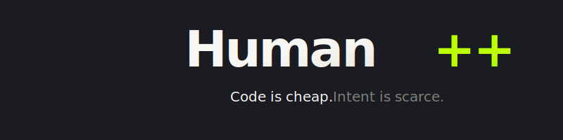
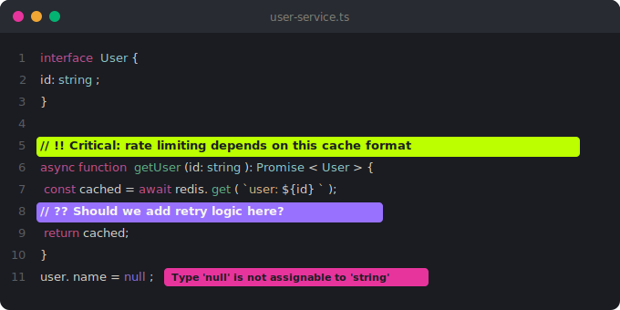
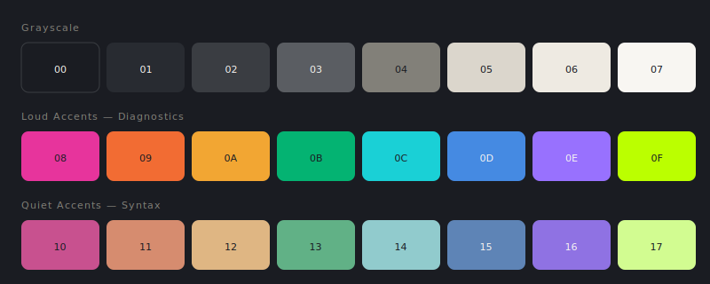

<p align="center">
  <picture>
    <source media="(prefers-color-scheme: dark)" srcset="site/assets/banner-dark.svg">
    <source media="(prefers-color-scheme: light)" srcset="site/assets/banner-light.svg">
    
  </picture>
</p>

<p align="center">
  A Base24 color scheme for the post-artisanal coding era.
</p>

<p align="center">
  <a href="https://fielding.github.io/human-plus-plus/">Website</a> •
  <a href="#install">Install</a> •
  <a href="#the-palette">Palette</a> •
  <a href="#human-intent-markers">Markers</a>
</p>

---

As models write more code, humans spend more time reviewing, planning, and explaining intent. Human++ makes human judgment visible at a glance through a two-tier accent system and lightweight annotation markers.

<p align="center">
  
</p>

## Philosophy

Human++ inverts the traditional syntax highlighting priority:

- **Quiet syntax** — everyday code fades into the background
- **Loud diagnostics** — errors, warnings, and human markers demand attention
- **Terminal exception** — terminal output is intentional, so terminals get loud colors

The result: when you see color, it means something.

## The Palette

<p align="center">
  <picture>
    <source media="(prefers-color-scheme: dark)" srcset="site/assets/palette-dark.svg">
    <source media="(prefers-color-scheme: light)" srcset="site/assets/palette-light.svg">
    
  </picture>
</p>

Human++ uses a cool charcoal grayscale with warm cream text and a full Base24 palette:

- **base00–07** — Cool grayscale from charcoal to warm cream
- **base08–0F** — Loud accents for diagnostics and signals
- **base10–17** — Quiet accents for syntax and UI

<details>
<summary>Full palette reference</summary>

### Grayscale

| Slot | Hex | Role |
|------|-----|------|
| base00 | `#1a1c22` | Background |
| base01 | `#282b31` | Elevation |
| base02 | `#3a3d42` | Selection |
| base03 | `#5a5d62` | Comments |
| base04 | `#828079` | UI secondary |
| base05 | `#dbd6cc` | Main text |
| base06 | `#eeeae2` | Emphasis |
| base07 | `#f8f6f2` | Brightest |

### Loud Accents (Diagnostics & Signals)

| Slot | Hex | Role |
|------|-----|------|
| base08 | `#e7349c` | Errors, attention |
| base09 | `#f26c33` | Warnings |
| base0A | `#f2a633` | Caution |
| base0B | `#04b372` | Success |
| base0C | `#1ad0d6` | Info |
| base0D | `#458ae2` | Links, focus |
| base0E | `#9871fe` | Special |
| base0F | `#bbff00` | Human intent marker |

### Quiet Accents (Syntax & UI)

| Slot | Hex | Role |
|------|-----|------|
| base10 | `#c8518f` | Keywords |
| base11 | `#d68c6f` | Secondary |
| base12 | `#dfb683` | Strings |
| base13 | `#61b186` | Functions |
| base14 | `#91cbcd` | Types |
| base15 | `#5e84b6` | Hints |
| base16 | `#8f72e3` | Constants |
| base17 | `#d2fc91` | Quiet lime |

</details>

## Human Intent Markers

Use punctuation markers in comments to flag human judgment:

| Marker | Meaning | Color |
|--------|---------|-------|
| `!!` | Pay attention here | Lime (base0F) |
| `??` | I'm uncertain | Purple (base0E) |
| `>>` | See reference | Cyan (base0C) |

```js
// Regular comment stays calm (base03)

// !! Critical: don't change without talking to Sarah
if (legacyMode) {
  // ?? Not sure this handles the edge case
  return transformLegacy(data);
}

// >> See utils.ts for the transform logic
return transform(data);
```

### Why punctuation?

- Fast to type
- Easy to scan
- Easy to grep: `rg "// !!|// \?\?|// >>"`
- Easy for editors to highlight

## Install

### VS Code / Cursor (Recommended)

The VS Code extension includes the full theme plus **marker highlighting** and **inline diagnostics**:

```bash
# Build and install from source
cd packages/vscode-extension
npm install && npx @vscode/vsce package
code --install-extension human-plus-plus-1.0.0.vsix
```

Or download `human-plus-plus-*.vsix` from [Releases](https://github.com/fielding/human-plus-plus/releases).

**Features:**
- Color theme with quiet syntax + loud diagnostics
- Marker highlighting (`!!`, `??`, `>>`) with colored backgrounds
- Inline diagnostic badges for errors/warnings

### Other Apps

All theme files are generated from `palette.toml`:

```bash
git clone https://github.com/fielding/human-plus-plus
cd human-plus-plus
make build    # Generate all themes
make apply    # Apply to installed apps
```

| App | Location |
|-----|----------|
| Ghostty | `dist/ghostty/config` |
| Vim / Neovim | via tinty |
| Sketchybar | `dist/sketchybar/colors.sh` |
| JankyBorders | `dist/borders/bordersrc` |
| skhd | `dist/skhd/modes.sh` |

### With tinty

```bash
tinty apply base24-human-plus-plus
```

## Development

```bash
make build          # Build all theme files
make preview        # Preview palette in terminal
make colortest      # Display terminal ANSI mapping
make apply-dry      # Preview what apply would do
make analyze        # Analyze palette in OKLCH
```

### Repository Structure

```
palette.toml          # Single source of truth (edit this)
templates/            # Theme templates
tools/                # Python generators
scripts/              # Shell orchestration
site/assets/          # Logos and images
```

**Generated (gitignored):**
```
dist/                 # Theme outputs
site/data/            # Palette JSON
```

## License

MIT
